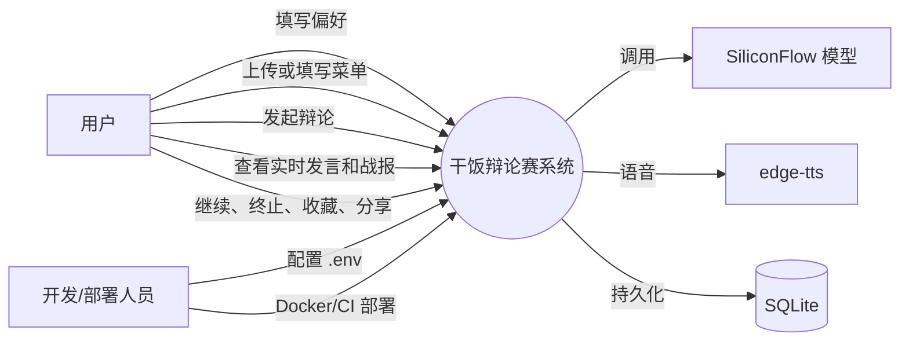
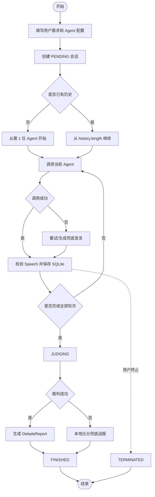
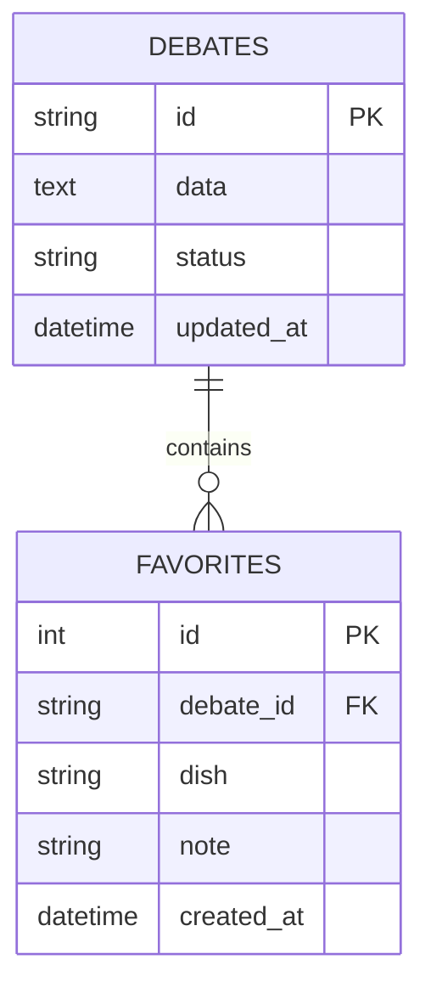
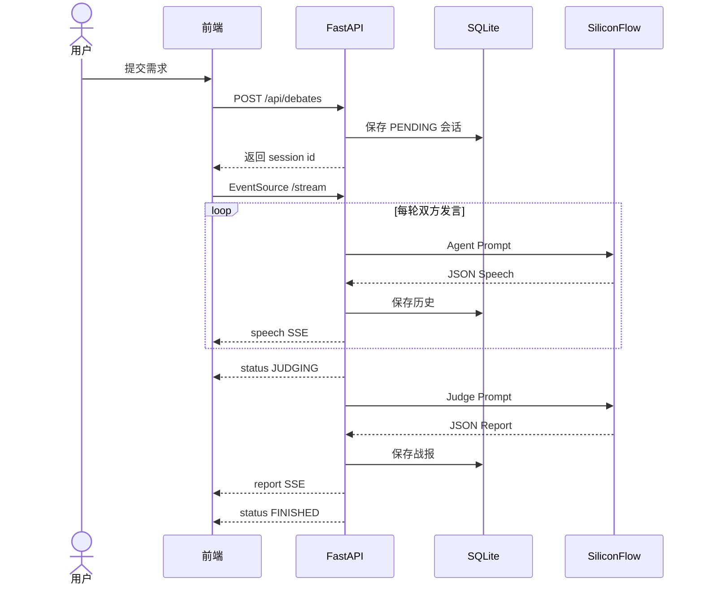
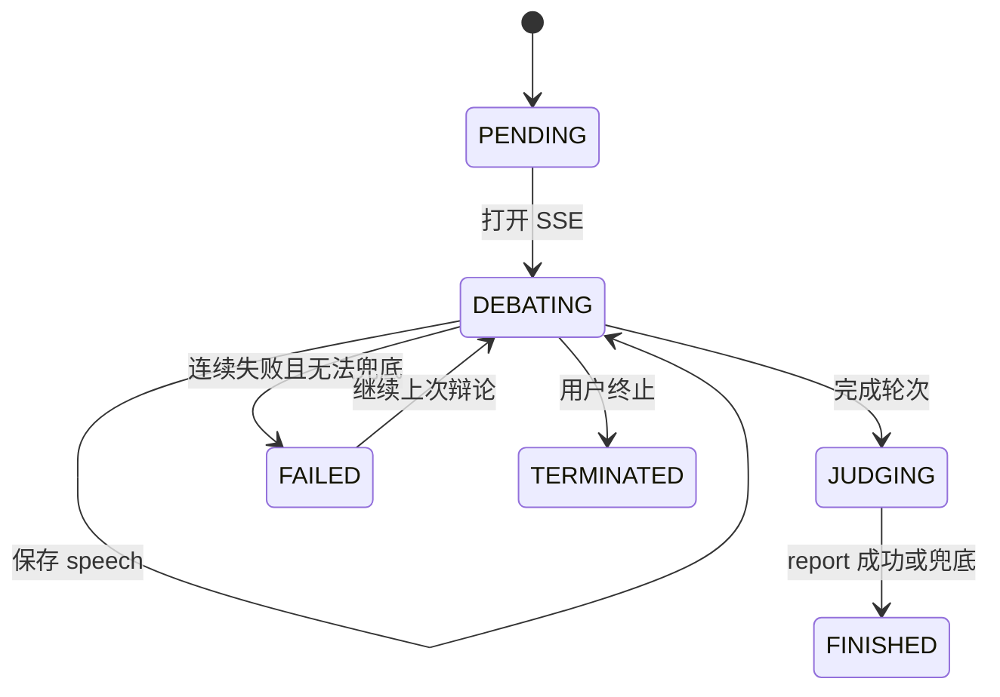
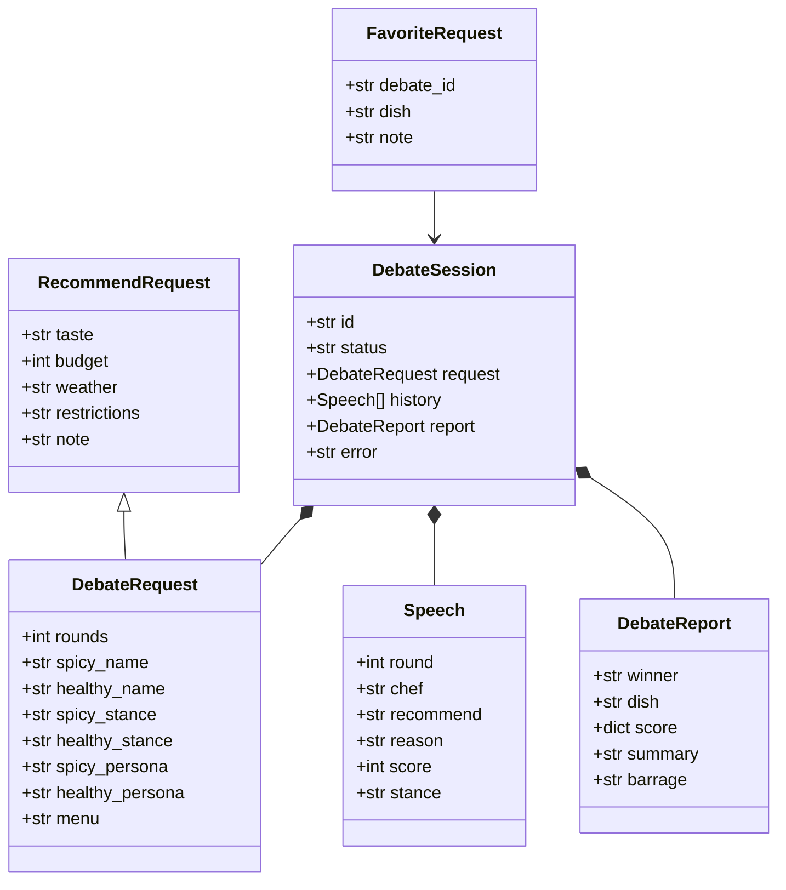

# 干饭辩论赛项目开发说明文档
## 文档说明
本文档用于说明“干饭辩论赛”系统的开发环境、技术选型、代码规范、需求分析、数据库设计、功能实现、运行结果、测试过程以及项目总结。

## 目录
1. [开发环境及相关技术](#1-开发环境及相关技术)
2. [代码规范要求](#2-代码规范要求)
3. [设计和实现过程](#3-设计和实现过程)
   - [3.1 需求分析](#31-需求分析)
   - [3.2 数据库设计](#32-数据库设计)
   - [3.3 系统架构设计](#33-系统架构设计)
   - [3.4 功能实现](#34-功能实现)
   - [3.5 系统运行结果](#35-系统运行结果)
   - [3.6 测试](#36-测试)
4. [总结体会](#4-总结体会)

---

# 1. 开发环境及相关技术
## 1.1 开发环境
| 项目 | 配置 |
| --- | --- |
| 操作系统 | Windows x64 |
| Python | 3.11+，当前开发环境使用虚拟环境 `.venv` |
| IDE | Visual Studio Code 或兼容 Python 的开发工具 |
| 后端启动方式 | Uvicorn + FastAPI |
| 数据库 | SQLite |
| 容器环境 | Docker、Docker Compose |
| 持续集成 | GitHub Actions |
| 浏览器 | Chrome、Edge 或其他支持 EventSource 的现代浏览器 |

## 1.2 主要技术
- **FastAPI**：构建后端 HTTP API，提供参数校验、自动接口文档和异步路由。
- **Pydantic**：定义请求、发言、战报和会话模型，限制字段长度和数值范围。
- **httpx**：异步调用 SiliconFlow 的 OpenAI 兼容 Chat Completions 接口。
- **Server-Sent Events（SSE）**：把辩论状态、厨师发言、战报和失败信息实时推送给浏览器。
- **原生 HTML/CSS/JavaScript**：实现表单、时间线、战报、语音、收藏和历史界面，不依赖前端框架。
- **SQLite**：保存会话进度、历史辩论和收藏菜品，不要求额外安装 MySQL 服务。
- **edge-tts**：提供中文语音播报接口。
- **Canvas API**：在浏览器中生成战报分享海报。
- **Docker**：封装运行环境，降低部署差异。
- **GitHub Actions**：自动安装依赖、编译检查和构建 Docker 镜像。

## 1.3 项目启动
```powershell
python -m venv .venv
.\.venv\Scripts\Activate.ps1
pip install -r requirements.txt
uvicorn backend.main:app --reload --port 8000
```

浏览器访问：`http://127.0.0.1:8000/`。API 文档访问：`http://127.0.0.1:8000/docs`。

项目通过根目录 `.env` 读取 `SILICONFLOW_API_KEY` 和 `SILICONFLOW_MODEL`。密钥只在后端使用，不应写入代码、README、日志或提交到 Git 仓库。

# 2. 代码规范要求
## 2.1 Python 规范
1. 使用 4 个空格缩进，不使用 Tab。
2. 类名采用 `PascalCase`，函数和变量采用 `snake_case`。
3. 路由函数使用清晰的请求模型和响应模型。
4. 重要函数添加返回类型标注，例如 `-> DebateSession`。
5. 配置、API Key 和运行数据不得硬编码在业务代码中。
6. 对外部网络请求设置超时时间，并捕获 HTTP、JSON 和模型校验异常。
7. 使用 Pydantic 校验所有用户输入和模型输出。
8. 产生副作用的操作，例如数据库写入，应集中在明确的函数或接口中。

## 2.2 前端规范
1. 模型生成内容使用 `textContent` 写入页面，避免直接拼接 `innerHTML`。
2. 表单输入设置 `required`、`maxlength`、`min` 和 `max` 等约束。
3. 请求失败时向用户显示可理解的提示，不显示敏感信息。
4. SSE 连接必须在完成、失败、终止和重新开始时关闭。
5. 自定义名称、立场和人设必须使用默认值兜底。

## 2.3 数据和安全规范
- `.env`、`ganfan.sqlite3`、`debates.json` 和日志文件不提交到仓库。
- API Key 只发送给 SiliconFlow，不通过前端接口返回。
- 对用户输入进行长度限制，防止异常大请求。
- 数据库操作使用参数化 SQL，避免 SQL 注入和占位符错误。

# 3. 设计和实现过程
## 3.1 需求分析
### 3.1.1 项目背景
用户在日常用餐选择中通常需要同时考虑口味、预算、天气、忌口和可获得菜品。普通推荐只给出单一结论，缺少对比和解释。本项目通过两位立场不同的 AI 厨师进行结构化辩论，再由裁判生成结论，使推荐过程更有趣、更透明。

### 3.1.2 用户需求
用户可以填写：
- 口味偏好；
- 预算，范围为 1-500 元；
- 天气；
- 忌口或过敏信息；
- 补充说明；
- 辩论轮数，范围为 1-5 轮；
- 两位 Agent 的名称、立场和人设；
- 可选候选菜单。

系统需要支持：
1. 创建辩论会话；
2. 双方按固定轮数交替发言；
3. 实时显示发言；
4. 裁判生成胜者、菜品、比分、总结和弹幕；
5. 模型调用失败后保留已完成进度；
6. 刷新页面后继续未完成会话；
7. 终止当前或全部未完成会话；
8. 保存历史战报和收藏菜品；
9. 提供语音播报、音效和分享海报。

### 3.1.3 非功能需求
- **可用性**：模型请求失败时不让页面崩溃。
- **安全性**：API Key 不暴露给浏览器。
- **可维护性**：使用 Pydantic 模型和明确接口。
- **可部署性**：支持本地 Python 和 Docker 运行。
- **可恢复性**：每条发言完成后立即持久化。

### 3.1.4 用例图
需求分析阶段使用 UML 用例图明确参与者和系统边界。可将下面 Mermaid 代码复制到支持 Mermaid 的编辑器中渲染：



### 3.1.5 辩论活动图


## 3.2 数据库设计
### 3.2.1 数据库选型
项目使用 SQLite。SQLite 不需要单独安装数据库服务器，适合本项目的单机开发、课程设计和 Docker 单实例部署场景。数据库文件为：

```text
ganfan.sqlite3
```

### 3.2.2 debates 表
| 字段 | 类型 | 说明 |
| --- | --- | --- |
| `id` | TEXT | 会话唯一 ID，主键 |
| `data` | TEXT | JSON 序列化后的完整会话数据 |
| `status` | TEXT | 当前状态，如 `PENDING`、`DEBATING`、`JUDGING`、`FINISHED` |
| `updated_at` | TEXT | 最近更新时间 |

完整会话数据中包含用户请求、Agent 配置、发言历史、最终战报和错误信息。将会话整体序列化，能够兼容 Agent 字段和战报字段的迭代。

### 3.2.3 favorites 表
| 字段 | 类型 | 说明 |
| --- | --- | --- |
| `id` | INTEGER | 自增主键 |
| `debate_id` | TEXT | 来源辩论会话 ID |
| `dish` | TEXT | 收藏菜品名称 |
| `note` | TEXT | 收藏备注 |
| `created_at` | TEXT | 收藏时间 |

### 3.2.4 数据库初始化
后端启动时执行 `CREATE TABLE IF NOT EXISTS`，因此第一次启动会自动创建表。旧版本的 `debates.json` 在 SQLite 没有数据时会自动迁移，避免历史记录丢失。

### 3.2.5 数据库操作流程
```text
创建会话 -> 写入 debates
生成一条 speech -> 更新 debates.data
生成 report -> 更新 debates
点击收藏 -> 写入 favorites
打开历史/收藏 -> 查询 SQLite
终止会话 -> 更新 debates.status
```

### 3.2.6 数据库 ER 图


## 3.3 系统架构设计
```text
浏览器
  ├─ POST /api/debates
  ├─ EventSource /api/debates/{id}/stream
  ├─ GET /api/debates
  ├─ POST /api/debates/{id}/stop
  ├─ GET/POST /api/favorites
  └─ GET /api/tts
          |
          v
FastAPI + Pydantic
  ├─ 会话状态机和轮次控制
  ├─ Agent Prompt 组装
  ├─ SSE StreamingResponse
  ├─ SQLite 持久化
  └─ edge-tts 音频生成
          |
          v
SiliconFlow Chat Completions
  ├─ Agent A
  ├─ Agent B
  └─ Judge Agent
```

主要状态流转：

```text
PENDING -> DEBATING -> JUDGING -> FINISHED
              \-> FAILED
              \-> TERMINATED
```

默认 3 轮需要 6 次厨师调用和 1 次裁判调用。每次成功生成后立即写入 SQLite，断线后根据历史长度计算下一位 Agent。

### 3.3.1 时序图


### 3.3.2 状态图


## 3.4 功能实现
### 3.4.1 请求模型和默认值
后端使用 `DebateRequest` 描述一次辩论请求，并限制轮数、名称、人设和菜单长度。用户没有填写自定义立场、人设或补充说明时，使用默认配置；这样前端留空不会把空字符串传给模型。

示例：

```json
{
  "taste": "想吃辣",
  "budget": 30,
  "weather": "晴天",
  "restrictions": "无",
  "rounds": 3,
  "spicy_name": "辣子哥",
  "spicy_stance": "spicy",
  "spicy_persona": "火爆川菜大厨，无辣不欢",
  "healthy_name": "清补凉",
  "healthy_stance": "healthy",
  "healthy_persona": "温和粤菜师傅，讲究本味和均衡",
  "menu": "麻婆豆腐、番茄炒蛋、青椒肉丝"
}
```

### 3.4.2 Agent 辩论
后端根据当前轮次选择 Agent，并把以下内容放入 Prompt：
- 用户的口味、预算、天气和忌口；
- 当前 Agent 名称、可配置立场和人设；
- 对手名称；
- 已有的完整历史；
- 菜单约束；
- 固定 JSON 输出格式。

模型返回后先进行 JSON 解析，再使用 `Speech.model_validate()` 校验，只有校验成功才会发送给前端。

### 3.4.3 SSE 实时推送
前端通过 `EventSource` 连接流式接口。服务端推送的主要事件如下：

| 事件 | 作用 |
| --- | --- |
| `status` | 通知辩论、裁判和完成状态 |
| `speech` | 推送一条厨师发言 |
| `report` | 推送最终战报 |
| `failure` | 推送错误信息 |
| `stopped` | 通知用户主动终止 |

### 3.4.4 失败重试和兜底
每次厨师模型调用最多重试 3 次。连续失败时，系统根据菜单或已有推荐生成本地兜底发言，继续后续流程。裁判调用失败时，根据双方平均分生成本地兜底战报，保证用户仍能得到结果。

### 3.4.5 历史和收藏
- `GET /api/debates` 返回历史会话列表；
- `GET /api/debates/{id}` 查询具体会话；
- `POST /api/favorites` 保存菜品；
- `GET /api/favorites` 查看收藏；
- `DELETE /api/favorites/{id}` 删除收藏；
- `POST /api/debates/{id}/stop` 终止指定会话；
- `POST /api/debates/stop-all` 终止所有未完成会话。

### 3.4.6 语音、音效和海报
- `/api/tts` 调用 edge-tts 输出 MPEG 音频；
- 每条发言提供“播报”按钮；
- 每轮结束使用 Web Audio API 播放提示音；
- 最终战报通过 Canvas 生成 PNG 分享海报；
- 浏览器支持时使用 Web Share API 分享，否则复制文字。

### 3.4.7 菜单样例与菜单分类
根目录 `menu.csv` 提供可直接上传和修改的菜单样例，包含川菜、家常菜、酸甜苦辣菜品、盖浇饭、炒饭、面食、水饺、烧烤、奶茶、甜品和饮品。每行提供分类、价格、辣度、主要食材、忌口标签、可用状态和推荐说明，便于 Agent 按预算、口味和饮食限制筛选。

### 3.4.8 Docker 和 CI
Docker 使用 `python:3.11-slim`，安装 `requirements.txt` 后启动 Uvicorn。镜像包含 `menu.csv` 和项目开发说明文档；Docker Compose 将 `ganfan.sqlite3`、`debates.json` 和 `menu.csv` 挂载到容器外，以便保存数据和替换菜单。GitHub Actions 执行依赖安装、Python 编译检查和 Docker 镜像构建。

### 3.4.9 核心类图
功能实现阶段使用类图描述 Pydantic 数据模型及其关系。`DebateSession` 聚合用户请求、发言历史和最终战报，`FavoriteRequest` 用于收藏接口。



## 3.5 系统运行结果
### 3.5.1 页面运行结果
系统首页展示：
1. 用户需求输入区域；
2. 两位 Agent 名称、立场、人设输入；
3. 可用菜单输入；
4. 辩论轮数输入；
5. 辩论时间线；
6. 最终战报；
7. 历史战报和我的收藏入口。

提交后，页面按以下顺序出现内容：

```text
第1轮 · Agent A
第1轮 · Agent B
第2轮 · Agent A
第2轮 · Agent B
第3轮 · Agent A
第3轮 · Agent B
最终战报：胜者胜出
```

### 3.5.2 典型运行示例
输入：

```text
口味：想吃辣
预算：30 元
天气：晴天
忌口：无
菜单：麻婆豆腐、番茄炒蛋、青椒肉丝
```

系统会将菜单作为模型约束，并在每轮生成发言。最终战报显示胜者、推荐菜、比分、总结和弹幕。点击“收藏菜品”后，菜品可以在“我的收藏”中查看。

### 3.5.3 中断恢复结果
若在第 2 轮发生网络中断，已经生成的发言会写入 SQLite。刷新页面后显示：

```text
继续上次辩论（已完成 3/6 条）
```

点击按钮后系统从下一条发言继续，不重复调用已保存内容。

### 3.5.4 终止结果
点击“终止当前辩论”后：
- SSE 连接关闭；
- 会话状态变为 `TERMINATED`；
- 已完成历史仍可查询；
- 该会话不会继续生成；
- 历史列表仍保留该记录。

### 3.5.5 Docker 运行结果
```powershell
docker compose up --build
```
容器启动后访问 `http://127.0.0.1:8000/`。SQLite 文件通过 Volume 保存在宿主机，容器重启不会丢失历史和收藏。

# 3.6 测试
## 3.6.1 测试环境
- Python 3.11+
- FastAPI 与 Uvicorn
- SQLite
- Chrome 或 Edge 浏览器
- SiliconFlow API 配置
- Docker（用于镜像构建测试）

## 3.6.2 后端静态检查
执行：

```powershell
.\.venv\Scripts\python.exe -m py_compile backend\main.py
```

预期结果：

```text
Python syntax OK
```

## 3.6.3 黑盒测试设计
本项目主要采用软件工程课程中的黑盒测试方法，不查看函数内部实现，只根据输入、输出和接口契约验证系统行为。

### （1）等价类划分法
| 输入项 | 有效等价类 | 无效等价类 |
| --- | --- | --- |
| `budget` | 1-500 的整数 | 小于 1、大于 500、非整数 |
| `rounds` | 1-5 的整数 | 0、6、负数、非整数 |
| `taste` | 1-100 字符非空文本 | 空文本、超过 100 字符 |
| 菜单文件 | UTF-8 CSV、合法 XLSX、5MB 以内 | 其他扩展名、损坏文件、超过 5MB |
| 自定义名称 | 1-30 字符 | 空名称、超过 30 字符 |
| 语音文本 | 1-500 字符 | 空文本、超过 500 字符 |

### （2）边界值分析法
重点测试边界值及其邻近值：

| 字段 | 下边界 | 下边界-1 | 上边界 | 上边界+1 |
| --- | ---: | ---: | ---: | ---: |
| `budget` | 1 | 0 | 500 | 501 |
| `rounds` | 1 | 0 | 5 | 6 |
| `taste` 长度 | 1 | 0 | 100 | 101 |
| `menu` 长度 | 1 | 0 | 50000 | 50001 |

预期：有效边界值通过 Pydantic 校验，越界值返回 HTTP 422；文件超过 5MB 返回 HTTP 413。

### （3）场景法/因果关系测试
| 场景 | 条件 | 预期结果 |
| --- | --- | --- |
| B01 | 无文件、无文本菜单 | Agent 自行举例推荐 |
| B02 | 只有文本菜单 | Agent 只从文本候选中选择 |
| B03 | 只有 CSV/XLSX 文件 | 文件菜单自动填入并作为候选 |
| B04 | 文件和文本同时存在 | 两者合并作为候选菜单 |
| B05 | 菜单缺少价格 | Agent 按预算估算价格 |
| B06 | 中途断线 | 已有历史保留，刷新后继续 |
| B07 | 用户终止 | 状态为 `TERMINATED`，不再生成 |
| B08 | 裁判调用失败 | 返回本地兜底战报 |

### （4）接口黑盒测试表
| 编号 | 测试内容 | 请求 | 预期结果 |
| --- | --- | --- | --- |
| T01 | 创建会话 | `POST /api/debates` | 返回 201 和会话 ID |
| T02 | 查询会话 | `GET /api/debates/{id}` | 返回状态和历史 |
| T03 | 开始 SSE | `GET /api/debates/{id}/stream` | 返回 200 和事件流 |
| T04 | 轮数边界 | `rounds=0/6` | 返回 422 |
| T05 | 空必填字段 | 空口味或天气 | 返回 422 |
| T06 | 历史列表 | `GET /api/debates` | 返回 SQLite 中的会话 |
| T07 | 终止会话 | `POST /api/debates/{id}/stop` | 状态变为 TERMINATED |
| T08 | 收藏菜品 | `POST /api/favorites` | 返回收藏记录 |
| T09 | 查询收藏 | `GET /api/favorites` | 返回收藏列表 |
| T10 | 删除收藏 | `DELETE /api/favorites/{id}` | 返回 deleted=true |
| T11 | 语音接口 | `GET /api/tts` | 返回 audio/mpeg |
| T12 | 上传 CSV | `POST /api/menu/upload` | 返回菜单条数和候选文本 |
| T13 | 上传 XLSX | `POST /api/menu/upload` | 返回菜单条数和候选文本 |

## 3.6.4 白盒测试设计
白盒测试关注代码内部逻辑，以 `_debate_stream` 为核心进行结构覆盖分析。

### （1）语句覆盖
至少执行以下语句：
- 设置 `DEBATING` 状态并发送 `status`；
- 调用 `_call_chef` 并追加 `session.history`；
- `_save_session` 持久化发言；
- 完成轮次后进入 `JUDGING`；
- 调用 `_call_judge` 并生成 `report`；
- 设置 `FINISHED`；
- 异常时设置 `FAILED` 并发送 `failure`；
- 终止时发送 `stopped`。

### （2）分支覆盖
| 分支 | 覆盖场景 |
| --- | --- |
| `if session.status == "TERMINATED"` | 生成过程中调用终止接口 |
| 模型调用成功/失败 | 正常模型返回、超时、非法 JSON |
| 重试次数 `< 3` / 达到 3 次 | 第一次成功、连续三次失败 |
| `session.report is None` | 裁判成功、裁判失败使用兜底 |
| `status == FINISHED` | 正常结束后再次打开流 |
| `lock.locked()` | 同一会话并发打开两个 SSE |

### （3）基本路径测试
- P1：创建会话 → 正常生成全部 speech → 裁判成功 → `FINISHED`。
- P2：创建会话 → Agent 第一次失败 → 重试成功 → 继续生成。
- P3：创建会话 → Agent 连续失败 → 兜底 speech → 继续后续轮次。
- P4：完成发言 → 裁判三次失败 → `_fallback_report` → `FINISHED`。
- P5：生成期间终止 → `TERMINATED` → `stopped` → 流结束。
- P6：重复连接 → `asyncio.Lock` 拦截并返回 409。

### （4）单元测试建议
可使用 `pytest`、`unittest.mock.AsyncMock` 模拟 SiliconFlow，不依赖真实 API Key，重点测试 `_menu_candidates`、`_fallback_speech`、`_fallback_report` 和 `_debate_stream` 的状态变化。

## 3.6.5 SSE 事件顺序测试
默认 3 轮时，预期事件顺序包含：

```text
status(DEBATING)
speech
speech
status(round=1)
speech
speech
status(round=2)
speech
speech
status(round=3)
status(JUDGING)
report
status(FINISHED)
```

发生错误时应收到：

```text
failure
```

主动终止时应收到：

```text
stopped
```

## 3.6.6 数据库测试
测试项目：
1. 启动时自动创建 `debates` 和 `favorites` 表；
2. 创建会话后 `debates` 表增加记录；
3. 每条发言后会话 JSON 更新；
4. 收藏成功后 `favorites` 表增加记录；
5. 删除收藏后记录消失；
6. 重启服务后历史和收藏仍可查询；
7. 旧 `debates.json` 能迁移到 SQLite。

## 3.6.7 Agent 配置测试
| 测试 | 输入 | 预期 |
| --- | --- | --- |
| 默认配置 | 人设和立场留空 | 使用默认名称、立场和人设 |
| 自定义名称 | Agent A / Agent B | 发言和战报使用新名称 |
| 自定义立场 | 低糖优先 / 高蛋白优先 | Prompt 中分别对应立场 |
| 自定义人设 | 两种不同风格 | 双方风格互不串台 |
| 菜单约束 | 提供候选菜品 | 推荐优先来自菜单 |
| 菜单分类 | 上传 `menu.csv` | 能识别川菜、甜品、烧烤、水饺、盖浇饭、奶茶等分类 |

## 3.6.8 异常测试
- API Key 缺失：返回明确配置错误；
- 模型超时：重试并保存已有进度；
- 模型返回非法 JSON：进入重试或兜底；
- 裁判失败：生成本地比分战报；
- SSE 断开：刷新后可以继续；
- 重复打开流：被 `asyncio.Lock` 拦截；
- 删除不存在收藏：返回 404；
- 查询不存在会话：返回 404；
- 终止已结束会话：返回相应状态提示。

## 3.6.9 安全测试
- 前端通过 `textContent` 展示模型文本；
- 不把 API Key 放入 HTML、SSE 或 SQLite；
- 用户输入长度受 Pydantic 限制；
- SQLite 使用参数化 SQL；
- `.env`、数据库和运行数据加入 `.gitignore`。

# 4. 总结体会
本项目从单 Agent 推荐逐步扩展为双 Agent 辩论、裁判总结、语音播报、分享海报、自定义 Agent、历史记录和收藏系统，完整经历了需求分析、接口设计、模型调用、前端交互和部署配置等过程。

首先，多 Agent 系统不能只关注模型输出，还需要由服务端严格控制轮数和状态。通过 `PENDING -> DEBATING -> JUDGING -> FINISHED` 状态机，可以避免模型自行循环，也能让前端明确知道当前处于哪个阶段。

其次，外部模型服务具有不稳定性。网络超时、模型返回格式错误和服务限流都可能发生。因此每条发言都要在成功后立刻保存，失败时要重试或使用兜底结果。SQLite 让刷新页面和服务重启后的历史恢复成为可能。

再次，API Key 安全非常重要。模型请求必须由后端完成，前端只获取业务结果。错误信息也不能把请求头、密钥或内部异常直接返回给用户。

最后，SQLite、Docker 和 GitHub Actions 让项目从“本地能运行”进一步接近可交付系统。SQLite 适合当前单机部署，Docker 保证环境一致，CI 则可以在提交代码后自动进行基础检查。

项目仍有进一步改进空间：可以引入真正的数据库 ORM、用户登录、历史分页、菜单库存接口、自动化测试、任务队列和多实例部署。当前版本已经完成课程项目所需的核心功能，并形成了清晰的扩展基础。

---

## 附录：主要接口清单
| 方法 | 路径 | 功能 |
| --- | --- | --- |
| `GET` | `/` | 返回前端页面 |
| `POST` | `/api/recommend` | 单 Agent 推荐 |
| `GET` | `/api/tts` | 生成语音 |
| `POST` | `/api/debates` | 创建辩论 |
| `GET` | `/api/debates` | 查询历史战报 |
| `GET` | `/api/debates/{id}` | 查询单个会话 |
| `GET` | `/api/debates/{id}/stream` | SSE 辩论流 |
| `POST` | `/api/debates/{id}/stop` | 终止单个会话 |
| `POST` | `/api/debates/stop-all` | 终止所有未完成会话 |
| `GET` | `/api/favorites` | 查询收藏 |
| `POST` | `/api/favorites` | 新增收藏 |
| `DELETE` | `/api/favorites/{id}` | 删除收藏 |

## 附录：提交前检查清单
- [ ] `.env` 未提交，API Key 未出现在文档和日志中。
- [ ] `python -m py_compile backend/main.py` 通过。
- [ ] SQLite 会话和收藏可以写入、读取、删除。
- [ ] 默认 Agent 字段可以正常回退。
- [ ] 自定义名称、立场和人设能出现在发言中。
- [ ] SSE 完成、失败、终止事件顺序正确。
- [ ] Docker 镜像可以构建。
- [ ] 浏览器可以刷新恢复未完成会话。
